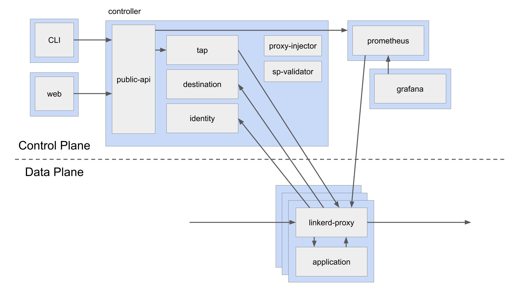
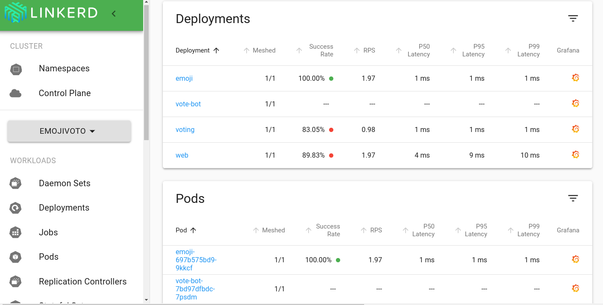

# Service Mesh

## Overview
Ultra light, ultra simple, ultra powerful. Linkerd adds security, observability, and 
reliability to Kubernetes, without the complexity. CNCF-hosted and 100% open source.

## How it works

!!! summary "How Linkerd works"
    Linkerd works by installing a set of ultralight, transparent proxies next to each
    service instance. These proxies automatically handle all traffic to and from the service.
    Because they’re transparent, these proxies act as highly instrumented out-of-process
    network stacks, sending telemetry to, and receiving control signals from, the control plane.
    This design allows Linkerd to measure and manipulate traffic to and from your service
    without introducing excessive latency.

### Architecture
{: style="width:750px"}
<figcaption style="font-size:15px">
<b>Figure:</b> Figure: Linkerd v2.10 architecture diagram.
(Source: Linkerd official documentation, 
<a href="https://linkerd.io/2.10/reference/architecture/index.html">
"High level Linkerd control plane and a data plane."</a>,
Linkerd Doc, accessed June 14th 2021).
</figcaption>

### Dashboard
{: style="width:750px"}
<figcaption style="font-size:15px">
<b>Figure:</b> Figure: Linkerd v2.10 dashboard.
(Source: Linkerd official documentation, 
<a href="https://linkerd.io/2.10/reference/architecture/index.html#dashboard">
"Linkerd dashboard"</a>,
Linkerd Doc, accessed June 14th 2021).
</figcaption>

## Read more

!!! info "Related resources"    
    * :ledger: [Linkerd vs Istio benchamrks](hhttps://linkerd.io/2021/05/27/linkerd-vs-istio-benchmarks/)

