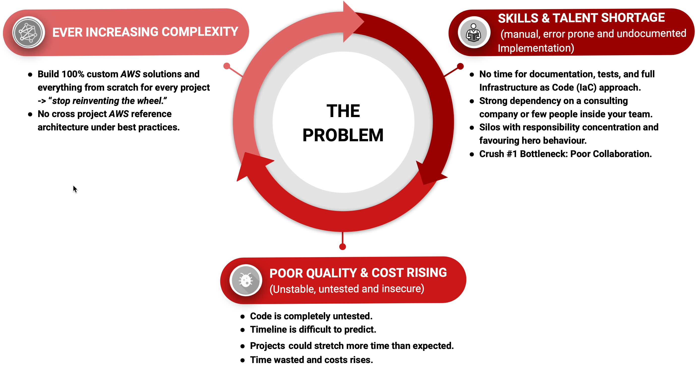
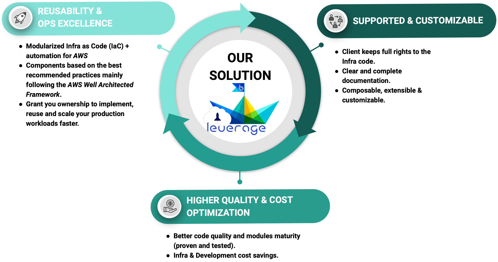

# Why Leverage?

## The problem
{: style="width:950px"}
<figcaption style="font-size:15px">
<b>Figure:</b> Why Leverage? The problem.
(Source: Binbash, "Leverage Presentation: Why you should use Leverage?", accessed June 15th 2021).
</figcaption>

## Our solution
{: style="width:950px"}
<figcaption style="font-size:15px">
<b>Figure:</b> Why Leverage? The solution.
(Source: Binbash, "Leverage Presentation: Why you should use Leverage?", accessed June 15th 2021).
</figcaption>

### The problem & our solution intro video
<iframe width="560" height="315" src="https://www.youtube.com/embed/-vb9Qtz6mLs" title="YouTube video player" frameborder="0" allow="accelerometer; autoplay; clipboard-write; encrypted-media; gyroscope; picture-in-picture" allowfullscreen></iframe>

## Why Leverage for CIOs, CTOs and VPs of Engineering?

!!! question "Why Leverage for CIOs, CTOs and VPs of Engineering?"
    - [x] **Accelerate development and optimize costs:**
    Annual cost savings are a new standard and best practice. Profits are being targeted to business development,
    regulatory and compliance needs. Resulting in a reduction of pressure on IT and development budgets, granting
    the opportunity to focus in new features and boost innovation.

    - [x] **Modernize applications architecture (loosely coupled and modular):**
    Strategically decompose the monolith into a fine-grained, loosely coupled modular architecture to increase both 
    development and business agility. When the system architecture is designed to allow teams to test, deploy and
    change systems without relying on other teams, they require little communication to get the job done. 
    In other words, both the architecture and the teams are loosely coupled.

    - [x] **Innovation - Rapidly adopt new technologies and reduce development time:**
    Use ***Leverage Reference Architecture and for AWS + our libraries*** to provide a collection of cloud application
    architecture components to build and deploy faster in the cloud. Building a cloud Landing Zone is complex, 
    especially since most companies have little or no expertise in this area. And it can take a significant amount 
    of time to get it right. ***Leverage*** a reference architecture to give you an AWS Landing Zone that provides a 
    consistent and solid "foundations" to bootstrap your project in the cloud. The code solution implements the best 
    AWS Well-Architected Framework practices as well as the battle-tested tech experience and years of knowledge of
    our contributors.

    - [x] **Hours or days, not weeks or months:**
    ***Leverage*** implements infrastructure as code at all times. We have rolled this out using Terraform, and has been
    fully proven in AWS and other Terraform providers that are part of our reference architecture like Kubernetes,
    Helm and Hashicorp Vault. By using the `leverage cli`, our binary will help you to quickly bootstrap your AWS
    Landing Zone in a matter of hours (or at most a few days).

    - [x] **It's not just a pile of scripts:**
    It's not just another layer of untested, one time and stand-alone developed scripts. The code is modularized
    and well designed under best practices, our `leverage cli` has both unit and integration tests. While our
    Terraform code has been extensively E2E tested. Moreover, 100% of the code is yours (to modify, extend,
    reuse, etc), with no vendor locking and vendor licensing fees. We use the MIT license, so you can take the
    code, modify it and use it as your private code. All we ask in return is a friendly greeting and that
    (if possible) consider contributing to ***Binbash Leverage*** project. Implement ***Leverage*** yourself or we 
    can deploy it for you!

    - [x] **DevOps culture and methodologies:**
    Team agility and continuous improvements based on feedback loops are some of the main drivers of cloud adoption,
    and IAC's goal of reducing the frequency of deployment of both infrastructure and applications are some of the
    most important aspects of DevOps practices. We continue to apply these methodologies to achieve a DevOps first
    culture. We have experienced and demonstrated their potential and have practiced them in dozens of projects over
    the past 5 years. The ***Leverage reference architecture for AWS*** combines a set of application best practices,
    technology patterns and a common CI/CD deployment approach through `leverage cli` for all your application 
    environments. As a result, we are pursuing a world-class software delivery performance through optimized
    collaboration, communication, reliability, stability, scalability and security at ever-decreasing cost and effort.

    - [x] **Repeatable, composable and extensible immutable infrastructure:**
    The best high-performance development teams create and recreate their development and production environments
    using infrastructure as code (IaC) as part of their daily development processes.
    The `leverage cli` allows to build repeatable and immutable infrastructure. So your cloud development, staging and 
    production environments will consistently be the same.

## Why Leverage for DevOps Engineers, Cloud Architects and Software Engineers?
!!! question "Why Leverage for DevOps Engineers, Cloud Architects and Software Engineers?"
    - [x] **Provisioning infrastructure as code (Iac):**
    Instead of manually provisioning infrastructure, the real benefits of cloud adoption come from orchestrating
    infrastructure through code. However, this is really challenging to achieve, there are literally thousands of
    tiny things and configs to consider and they all seem to take forever. Our experience is that it can take teams
    up to 24 months to achieve a desired infra state in AWS.
    By using ***Leverage*** you could get your AWS Landing-Zone in few weeks, or your entire
    AWS Well-Architected based cloud solution within 1 to 3 months (depending on your project complexity needs).

    - [x] **We've done it before (don't reinvent the wheel):**
    Often, development teams have similar and recurring requests such as: iam, networking, security, storage, 
    databases, compute and secret management, etc. Binbash ***Leverage*** has been proven in dozen of project to create
    software-defined (IaC) AWS environments.

    - [x] **Best practices baked in the code:**
    ***Leverage*** provides IaC reference architecture for AWS hosted applications infrastructure. This is baked into the
    code as a combination of the best AWS Well-Architected framework practices and the experience of having
    successfully orchestrated many customers to AWS cloud.

    - [x] **On-demand infra deployment:**
    ***Leverage*** provides your DevOps, Cloud, SRE and Development teams with the ability to provision on-demand
    infrastructure, granting that it will meet the rigorous security requirements of modern cloud native best practices. 
    It fully implements AWS Well-Architected Framework (WAF) and best DevOps practices, including practices, including
    collaboration, version control, CI/CD, continuous testing, cloud infrastructure and losely couple architectures.

    - [x] **Easier to support and maintain:**
    ***Leverage*** IaC approach significantly reduce your AWS infra deployment, config and support burden and reduce risk. 
    Our code backed provisioning has been rigorously tested many times, eliminating the possibility of manual errors. 
    Because the entire infrastructure is deployed from the same proven code, the consistency your cloud environments
    will simplify your setup and maintenance. Use the versioned code to iterate and improve, extend or compose your
    internal processes as your cloud operating model evolves.

    - [x] **There is no vendor lock-in. You own the solution:**
    With ***Leverage*** you own 100% of the code with no lock-in clauses. If you choose to leave ***Leverage***, you will still 
    have your entire AWS cloud infrastructure that you can access and manage. If you drop ***Leverage***, you will still
    have your entire cloud native infrastructure code (Terraform, Helm, Ansible, Python). It’s 100% Open Source
    on GitHub and is free to use with no strings attached under [MIT license](https://choosealicense.com/licenses/) 
    (no licensing fees), and you are free to commercially and privately use, distribute and modify.

    - [x] **Consistent environments (Dev/prod parity):**
    Keep development, staging, and production cloud envs parity.
    Infrastructure as code allow us to define and provisioning all infrastructure components (think networks, load 
    balancers, databases, security, compute and storage, etc.) using code. ***Leverage*** uses Terraform as the IaC language,
    to deploy and setup all the AWS, Kubernetes and Hashicorp Vault resources (it has support for multiple cloud and
    technology providers). Backed by code, your cloud environments are built exactly the identical way all the time. 
    Finally, this will result in no differences between development, staging and production.

    - [x] **Development in production like envs:**
    IaC allows your development team to deploy and test the AWS infrastructure as if it were application code. 
    Your development is always done in production-like environments. Provision your cloud test and sandbox 
    environments on demand and tear them down when all your testing is complete. ***Leverage*** takes all the pain
    out of maintaining production-like environments, with stable infra releases. It eliminates the unpredictability
    of wondering if what actually worked in your development envs will work in production.