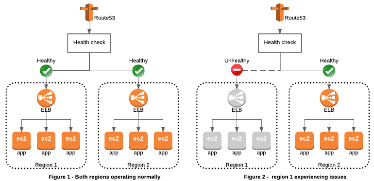
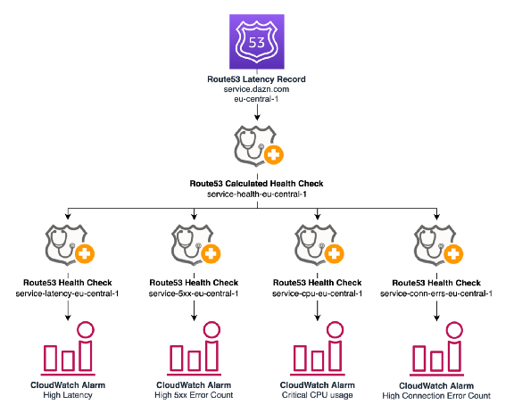

# Disaster Recovery & Business Continuity Plan 

## Overview 

Applications that are business critical should always have a plan in place to recover in case of a catastrophic failure
or disaster. There are many strategies that can be implemented to achieve this, and deciding between them is a matter
of analyzing how much is worth to invest based on calculation of damages suffered if the application is not available
for a given period of time. It is based on this factor (time) that disaster recovery plans are based on. Factors that
need to be determined per application are:

!!! danger "RTO and RPO"
    * :clock3: **Recovery time objective (RTO):** This represents the time it takes after a disruption to
    restore a business process to its service level. For example, if a disaster occurs at 12:00 PM (noon) and the RTO is
    eight hours, the DR process should restore the business process to the acceptable service level by 8:00 PM. 
    * :clock3: **Recovery point objective (RPO):** This is the acceptable amount of data loss measured in time. For example, if a
     disaster occurs at 12:00 PM (noon) and the RPO is one hour, the system should recover all data that was in the 
     system before that hour.

## High Availability Configuration Strategies 

After deciding RTO and RPO we have options available to achieve the time objectives:

!!! check "HA Strategies"
    * [x] **Backup and restore:** In most traditional environments, data is backed up to tape and sent off-site regularly.
     The equivalent in AWS would be to take backups in the form of snapshots and copy them to another region for RDS
     instances, EBS volumes, EFS and S3 buckets. The plan details the step-by-step procedure to recover a fully working
     production environment based on these backups being restored on freshly provisioned infrastructure, and how to
     rollback to a regular production site once the emergency is over.
    * [x] **Pilot Light Method:** The term pilot light is often used to describe a DR scenario in which a minimal version of
     an environment is always running in AWS. Very similar to “Backup and restore” except a minimal version of key
     infrastructure components is provisioned in a separate region and then scaled up in case of disaster declaration.
    * [x] **Warm standby active-passive method:** The term warm-standby is used to describe a DR scenario in which a
     scaled-down version of a fully-functional environment is always running in the cloud. Enhancement of Pilot Light
     in which a minimal version is created of all components, not just critical ones.
    * [x] **Multi-Region active-active method:** By architecting multi region applications and using DNS to balance
     between them in normal production status, you can adjust the DNS weighting and send all traffic to the AWS region
     that is available, this can even be performed automatically with Route53 or other DNS services that provide health
     check mechanisms as well as load balancing.

{: style="width:800px"}
<figcaption style="font-size:15px">
<b>Figure:</b> 2 sets of app instances, each behind an elastic load balancer in two separate regions (just as reference).
(Source: Randika Rathugamage, 
<a href="https://medium.com/@randika/high-availability-with-route53-dns-failover-c13cb30cbe94">
"High Availability with Route53 DNS Failover"</a>,
Medium blogpost, accessed December 1st 2020).
</figcaption>

{: style="width:800px"}
<figcaption style="font-size:15px">
<b>Figure:</b> AWS calculated — or parent — health check, we can fail on any number of child health checks (just as reference).
(Source: Simon Tabor, 
<a href="https://medium.com/dazn-tech/how-to-implement-the-perfect-failover-strategy-using-amazon-route53-1cc4b19fa9c7">
"How to implement the perfect failover strategy using Amazon Route53"</a>,
Medium blogpost, accessed December 1st 2020).
</figcaption>

## Read more

!!! info "AWS reference links"
    Consider the following AWS official links as reference:
        
    - :orange_book: [**AWS Documentation Amazon Route 53 Developer Guide | Configuring DNS failover**](https://docs.aws.amazon.com/Route53/latest/DeveloperGuide/dns-failover-configuring.html)
    
