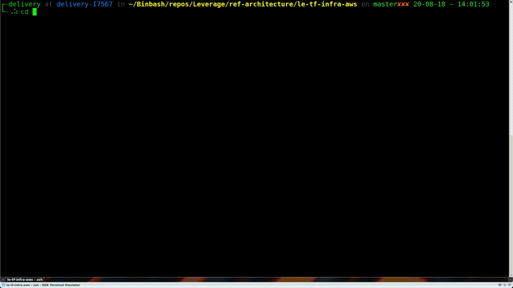

# AWS Credentials

## :warning: Below setup has been deprecated favoured for the new `leverage cli` >= v1.0.0
---

## Setup

!!! done "Automated AWS Credentials setup"
    1. Place your shell at `le-tf-infra-aws/@bin/scripts/aws_credentials_setup`
    2. Depending on your python version:
        - Run `pip install --no-cache-dir -r requirements.txt`
        - Run `pip3 install --no-cache-dir -r requirements.txt` 
    3. Run `python3 aws_setup_credentials.py`
    4. Follow the cli workflow shown immediately below to get a better understanding
    
{: style="width:1000px"}
<figcaption style="font-size:15px">
Figure: AWS credentials automated setup. 
</figcaption>

### Resulting Example for: `~/.aws/leverage/credentials`

```
#================================================================#
# LEVERAGE credentials                                           #
#================================================================#
#------------------------------------#
# AWS OrganizationAccountAccessRole  #
#------------------------------------#
[binbash-root]
aws_access_key_id = AKIXXXXXXXXXXXXXXXXXXXXX
aws_secret_access_key = cKJ2XXXXXXXXXXXXXXXXXXXXXXXXXXX
region = us-east-1

#------------------------------------#
# AWS DevOps Role                    #
#------------------------------------#
[binbash-security]
aws_access_key_id = AKXXXXXXXXXXXXXXXXXXXXXXX
aws_secret_access_key = cKJ29HXXXXXXXXXXXXXXXXXXXXXXXXX
region = us-east-1 
```

### Resulting Example for: `~/.aws/leverage/cofigs`

```
[default]
output = json
region = us-east-1

#================================================================#
# LEVERAGE config                                                #
#================================================================#
#------------------------------------#
# AWS OrganizationAccountAccessRole  #
#------------------------------------#
[profile binbash-security-oaar]
output = json
region = us-east-1
role_arn = arn:aws:iam::111111111111:role/OrganizationAccountAccessRole
source_profile = binbash-root

[profile binbash-shared-oaar]
output = json
region = us-east-1
role_arn = arn:aws:iam::222222222222:role/OrganizationAccountAccessRole
source_profile = binbash-root

[profile binbash-apps-devstg-oaar]
output = json
region = us-east-1
role_arn = arn:aws:iam::333333333333:role/OrganizationAccountAccessRole
source_profile = binbash-root

[profile binbash-apps-prd-oaar-replication]
output = json
region = us-east-2
role_arn = arn:aws:iam::444444444444:role/OrganizationAccountAccessRole
source_profile = binbash-root

[profile binbash-legacy-oaar]
output = json
region = us-east-1
role_arn = arn:aws:iam::555555555555:role/OrganizationAccountAccessRole
source_profile = binbash-root

#------------------------------------#
# AWS DevOps Role                    #
#------------------------------------#
[profile binbash-security-devops]
output = json
region = us-east-1
role_arn = arn:aws:iam::111111111111:role/DevOps
source_profile = binbash-security

[profile binbash-shared-devops]
output = json
region = us-east-1
role_arn = arn:aws:iam::222222222222:role/DevOps
source_profile = binbash-security

[profile binbash-apps-devstg-devops]
output = json
region = us-east-1
role_arn = arn:aws:iam::333333333333:role/DevOps
source_profile = binbash-security

[profile binbash-apps-prd-devops]
output = json
region = us-east-1
role_arn = arn:aws:iam::444444444444:role/DevOps
source_profile = binbash-security

[profile binbash-legacy-devops]
output = json
region = us-east-1
role_arn = arn:aws:iam::555555555555:role/DevOps
source_profile = binbash-security 
```

## Switching to a AWS Organization Member Account Role

!!! check "AWS reference links"
    Consider the following AWS official links as reference:
    
    - [x] :orange_book: [Access AWS Organization member account](https://aws.amazon.com/premiumsupport/knowledge-center/organizations-member-account-access/)        
        - :orange_book: [Switching to a Role (Web Console)](https://docs.aws.amazon.com/IAM/latest/UserGuide/id_roles_use_switch-role-console.html)
        - :orange_book: [Switching to an IAM Role (AWS CLI)](https://docs.aws.amazon.com/IAM/latest/UserGuide/id_roles_use_switch-role-cli.html)
        - :orange_book: [awscli roles]https://docs.aws.amazon.com/cli/latest/userguide/cli-roles.html
    - [x] :orange_book: [Environment variables to configure the AWS CLI](https://docs.aws.amazon.com/cli/latest/userguide/cli-configure-envvars.html)
        
        - Since our AWS Credentials files location is not as default please consider the below code before using the
          the awscli in your terminal
       
        ```bash
        $ AWS_SHARED_CREDENTIALS_FILE_VAR="~/.aws/bb-le/credentials"                                                  
        $ export AWS_SHARED_CREDENTIALS_FILE=${AWS_SHARED_CREDENTIALS_FILE_VAR}
        $ AWS_CONFIG_FILE_VAR="~/.aws/bb-le/config"
        $ export AWS_CONFIG_FILE=${AWS_CONFIG_FILE_VAR}  
        $ aws ec2 describe-instances --profile project-apps-devstg-devops 
        ```
        
        - Example
          
        ```bash
        ╭─delivery at delivery-I7567 in ~/Binbash/repos/Leverage/ref-architecture
        ╰─⠠⠵ AWS_SHARED_CREDENTIALS_FILE_VAR="~/.aws/bb/credentials"                                                   
        export AWS_SHARED_CREDENTIALS_FILE=${AWS_SHARED_CREDENTIALS_FILE_VAR}
        AWS_CONFIG_FILE_VAR="~/.aws/bb/config"   
        export AWS_CONFIG_FILE=${AWS_CONFIG_FILE_VAR}
        ╭─delivery at delivery-I7567 in ~/Binbash/repos/Leverage/ref-architecture
        ╰─⠠⠵ aws ec2 describe-instances --profile bb-apps-devstg-devops                                               
        {
        "Reservations": []
        }
        ```
    
    - [x] :orange_book: [Accessing a member account as the root user](https://docs.aws.amazon.com/organizations/latest/userguide/orgs_manage_accounts_access.html)
     
## Read More

!!! info "AWS reference links"
    Consider the following AWS official links as reference:        
    
    * :orange_book: [Best practices for managing AWS access keys](https://docs.aws.amazon.com/general/latest/gr/aws-access-keys-best-practices.html)
    * :blue_book: [Cloud.gov | Secret key management - AWS credentials ](https://cloud.gov/docs/ops/secrets/)
